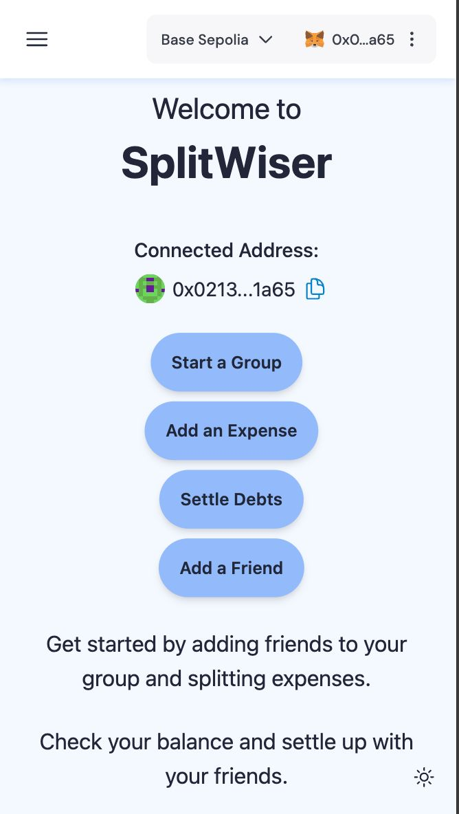
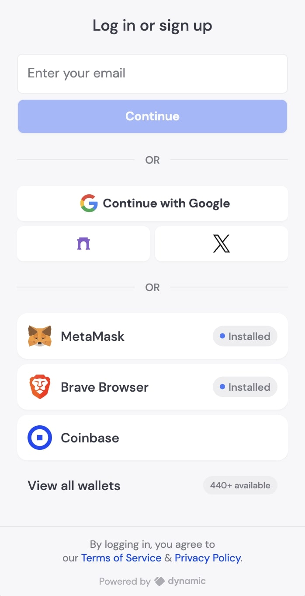
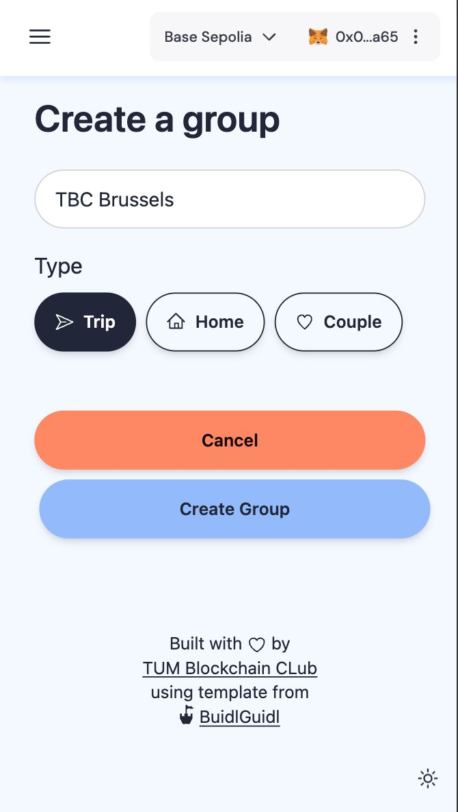
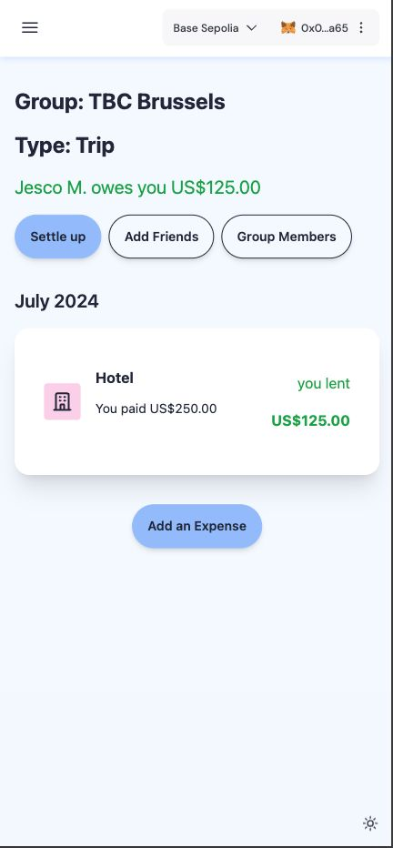
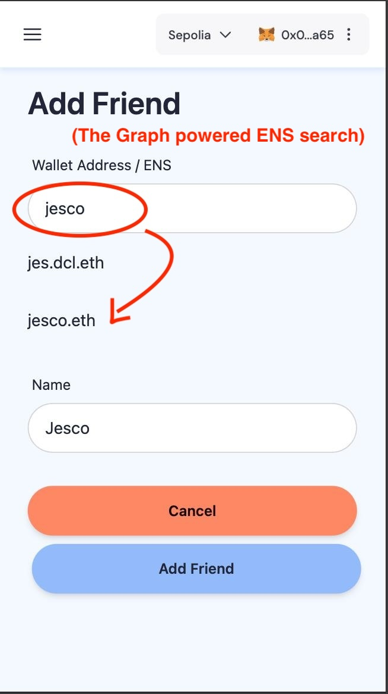
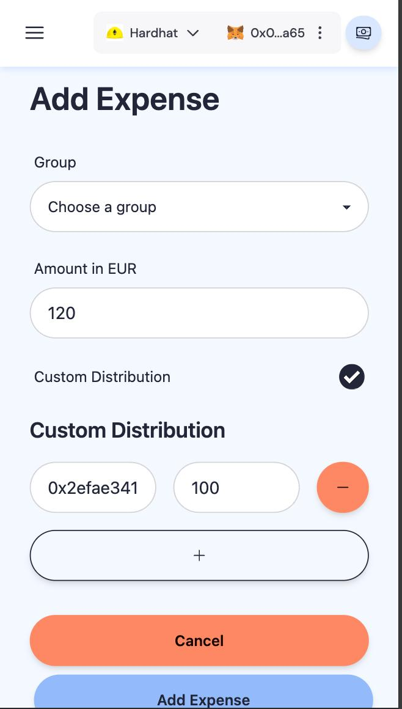
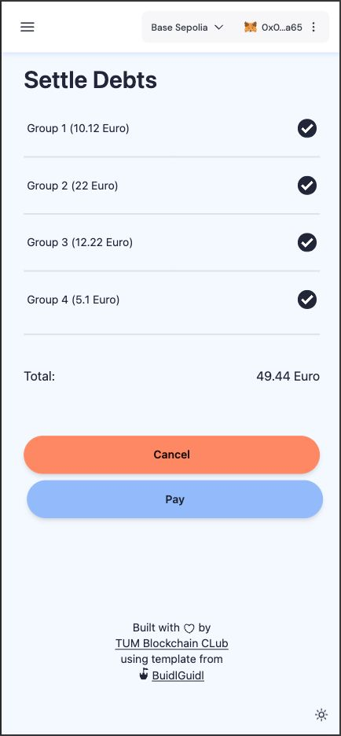

# Splitwiser - Split your bills with Web3 power and Web2 ease

[](image.png)

# Table of Contents  
- [Background](#background)  
- [Splitwiser](#splitwiser-description)
    - [Key Features](#key-features)
    - [Used Tools](#used-tools)
- [Development](#development)
    - [Requirements](#equirements)
    - [Quick Start](#quick-start)
        - [Further Documentation on used tools](#further-documentation-on-used-tools)
- [Gallery and Workflow](#gallery-and-workflow)
- [Contacts](#contacts)
- [License](#license)


## Background
 
In real world scenario, most people like to buy product or service together and choose to split the bill either uniformly or based on certain aspect. 
In web2 space, there are already solutions like [Splitwise](https://www.splitwise.com/) and [Tricount](https://tricount.com/). Several social platform, like WeChat and Line, also integrates such feature to their application, which also gained positive
response from their users. 

Despite all of that, they face several shortcomings. Even with its rebustness, Splitwise or similar does not automatically track the status
of the shared bill. Users still have to manually input how much money they transferred to settle their debt. Due to this limitation, Splitwise's user adoption rate is very slow in some countries. Additionally, applications like Splitwise have introduced their paid plans, which limit the number of groups and expenses you can track for free. Moreover, these applications are filled with annoying ads.
 
## Splitwiser description
 
 Splitwiser a solution to tackle peer-to-peer bill-tracking issues in traditional applications. By leveraging the power of web3 while maintaining the familiar workflows of web2, Splitwiser aims to onboard a new generation of users seamlessly. The smart contracts managing these actions are currently deployed on Ethereum and Base chains but are designed to be cross-chain, with plans to support more in the future. Respecting the transparent nature of web3, we are verifying our smart contracts on the Blockscout Explorer. The native currency is EURC by Circle, with more cryptocurrencies to be supported without additional conversion costs.

In Splitwiser, users can authenticate with both web2 and web3 methods. Once authenticated using the Dynamic system, users can create a new group (e.g., for an event) and add other participants. To simplify adding users, Splitwiser allows direct adding via wallet address and leverages The Graph queries and ENS for easy friend searches. After forming the group, its members can add expenses until the trip ends or when they need to settle the bill. Our debt simplification algorithm minimizes the number of transactions required by recursively matching the biggest debtors and creditors. 

All the interactions with the smart contract until the actual debt settlement are free for the users because of the Safe Smart Wallet feature. This feature sets Splitwiser apart from current web2 solutions, as it allows for infinite groups, members, and expenses without any charges, thanks to gas sponsorship by the application. The modern and familiar interface ensures that even common users can use our application without encountering any web3 complexity.

Splitwiser introduces direct on-chain payments within the app to finalize settlements. The smart contract handles the deposits and withdrawals, so users either need to supply their sum debt into the smart contract or wait until the smart contract pays out the promised debt.

Splitwiser's goal is not just to replicate a web2 app on-chain but to demonstrate how a proper UI/UX, account abstraction, gas fee subsidy, and other tools can create applications that leverage web3's potential while maintaining the ease of use of web2 apps. The Splitwiser team, former active users of the Splitwise web2 application, is now switching to their solution. They aim for this project to be widely used, not just another hackathon project.
 
### Key Features

**Integrated payments:** Aftet debt is calculated, the debtors have to transfer the debt into smart contracts which will then automatically redistribute the money to creditors.

**Barrier-free login:**  The app supports common web2 logins such as email and Google SSO as well as wallet login
 
**Gasless Transactions:** Utilizing Safe smart wallets, we shift responsibility of gas fee payment to developer and, so, eliminate the financial barrier to entry, making Web3 accessible to everyone.
 
**Cross-Chain Compatibility**: Built on Base, our app is designed to seamlessly integrate with other blockchains, fostering interoperability and user choice.
 
**Intuitive User Interface:** We leverage best practices in design and UX to create a seamless and enjoyable experience for all users.

### Used Tools

**Backend and Frontend:** [Scaffold-ETH 2](https://scaffoldeth.io/) (NextJs14 and Hardhat)

**Smart contracts:** [Solidity](https://soliditylang.org/)

**Login:** [Dynamic](https://www.dynamic.xyz/)

**Sponsored transactions & wallets:** [Safe smart wallets](https://safe.global/)

**Usernames:** [ENS](https://ens.domains/)

**User search:** [The Graph](https://thegraph.com/) with ENS

**Chains deployed:** Sepolia Ethereum and Sepolia [Base](https://www.base.org/)

**Native currency:** [EURC](https://www.circle.com/en/eurc)

# Development 
## Requirements

Before you begin, you need to install the following tools:

- [Node (>= v18.17)](https://nodejs.org/en/download/)
- Yarn ([v1](https://classic.yarnpkg.com/en/docs/install/) or [v2+](https://yarnpkg.com/getting-started/install))
- [Git](https://git-scm.com/downloads)

- You have to get a [Pimlico API key](https://dashboard.pimlico.io/sign-in) and put it in your env file (`NEXT_PUBLIC_PIMLICO_API_KEY`).

- You should send some ERC20 (USDC is better) to your Safe smart wallet in order to use the transfer and cross-chain transfer capabilities.

- You can use the default Dynamic environment ID to test, but we recommend you add your own as soon as possible in the env file (NEXT_PUBLIC_DYNAMIC_ENVIRONMENT_ID)

## Quickstart

To get started with Scaffold-ETH 2 Hacker Edition, follow the steps below:

1. Clone this repo & install dependencies

```
git clone https://github.com/TUM-Blockchain-Club/splitwiser.git
cd packages
yarn install
```

2. Run a local network in the first terminal:

```
yarn chain
```

This command starts a local Ethereum network using Hardhat. The network runs on your local machine and can be used for testing and development. You can customize the network configuration in `hardhat.config.ts`.

3. On a second terminal, deploy the test contract:

```
yarn deploy
```

This command deploys a test smart contract to the local network. The contract is located in `packages/hardhat/contracts` and can be modified to suit your needs. The `yarn deploy` command uses the deploy script located in `packages/hardhat/deploy` to deploy the contract to the network. You can also customize the deploy script.

4. On a third terminal, start your NextJS app:

```
yarn start
```

Visit your app on: `http://localhost:3000`. You can interact with your smart contract using the `Debug Contracts` page. You can tweak the app config in `packages/nextjs/scaffold.config.ts`.

For more detailed information on features and possibilities of Scaffold-ETH 2 please refer to [Scaffold-ETH 2 READMDE](./READ-scaffold.md).

### Further Documentation on used tools
- [Dynamic](https://docs.dynamic.xyz/)
- [Original Scaffold Eth 2](https://scaffold-eth-2-docs.vercel.app/)
- [Pimlico](https://docs.pimlico.io/)
- [Safe](https://docs.safe.global/)
- [Chainlink](https://docs.chain.link/)
- [Blockscout](https://docs.blockscout.com/for-users/api/rpc-endpoints)

## Gallery and Workflow
Lets go through the workflow one by one with some images for easier understanding:

### 1. Login to the APP

[](image.png)
[](image.png)

### 2. Create a new group for an event/trip

[](image.png)
[](image.png)

### 3. Add friend to a group
[](image.png)

### 4. Add expenses
[](image.png)

### 4. Settle debts
[](image.png)


## Contacts
**Team:**
- @LUOJIUzxy
- @itsmeyaw
- @tsatsch
- @jescom9
- @dragoscodes

With Love from TUM Blockchain Club

## License
The code is under the Open source licence: GPL-3.0-or-later

**Built with ❤ by**

[](image.png)
